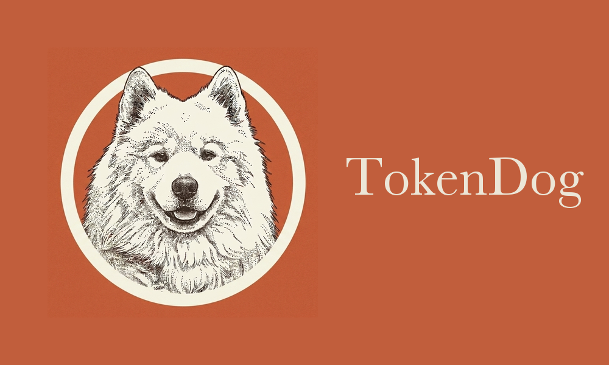

<!-- TokenDog: provider-neutral tool-output compression for AI coding agents -->
<div align="center">



### Compress the tool output your AI agent is about to pay for — *losslessly, before it's billed.*

[](https://github.com/uttej-badwane/TokenDog/actions/workflows/test.yml)
[](https://github.com/uttej-badwane/TokenDog/releases)
[](https://github.com/uttej-badwane/TokenDog/releases)
[](go.mod)
[](LICENSE)
[](CONTRIBUTING.md)
[](https://uttej-badwane.github.io/TokenDog/)

**Compresses for**
&nbsp;
[](#-deployment-modes)
[](#-deployment-modes)
[](#-deployment-modes)

<em>cache-safe by construction &nbsp;·&nbsp; single Go binary &nbsp;·&nbsp; nothing leaves your machine</em>

</div>

---

Coding agents burn tokens on output they barely read — verbose `git status`, `kubectl describe`, `terraform plan`, refresh spam, the same file read twice, 12&nbsp;KB of JSON. **TokenDog** sits between your agent and the model, finds the `tool_result` blocks in each request, and shrinks them **before the tokens are billed** — keeping every answer-bearing fact and proving it does.

```console
$ td gain --since 1d
TokenDog Savings (last 24h)
══════════════════════════════════════════════════════════
Total commands:     142 (proxy: 138, hook: 4)
Saved:              48.2KB (12,403 tokens, 18.7%)
Cost saved:         $0.19 (per-model rates, cl100k)
```

## ✨ Highlights

|   |   |
|---|---|
| 🪶 **~25 lossless filters** | `git` · `kubectl` · `terraform` · `gh` · `jq` · `npm` · test runners… structural noise stripped, signal kept **verbatim** |
| ♻️ **Reversible compression** | stash huge outputs, send a preview, let the model pull the original back on demand via MCP — nothing is *lost*, only *deferred* |
| 🔁 **Cross-message dedup** | re-read the same file? the duplicate collapses to a one-line back-reference (it's verbatim above already) |
| 🌐 **Multi-provider** | one engine, swappable adapters for **Anthropic / OpenAI / Bedrock** |
| 🔌 **Two ways in** | the MITM proxy (zero client config) **or** `td gateway` — explicit `base_url`, **no CA cert** (security-team friendly) |
| 🧪 **Proven quality** | `td eval` shows *deterministically* that no answer-bearing fact is ever dropped — numbers, not vibes |
| 📊 **Honest measurement** | `td gain` prices real per-model/per-provider savings; `td replay` runs the counterfactual on **your** history |
| 💵 **`/cost`-accurate spend** | `td statusline` renders your status line and captures Claude Code's own per-session cost, so `td spend` and the menu bar match `/cost` exactly |
| 🩺 **Code Harness audit** | `td harness` inventories and audits your whole Claude Code setup — settings, permissions, hooks, CLAUDE.md, memory, agents, MCP — offline and read-only, ranked findings with fixes |
| 🏢 **Fleet-ready** | opt-in aggregate reporting (no content leaves the box) + centrally-managed policy for platform teams |

## ⚡ Quick start

```bash
brew tap uttej-badwane/tokendog
brew install tokendog
td setup            # cert + auto-start + proxy env, all wired for you
```

Restart your AI client, then watch the savings roll in with `td gain`. Prefer **no CA cert**? Skip the MITM entirely:

```bash
td gateway --port 8099 --upstream https://api.anthropic.com
ANTHROPIC_BASE_URL=http://127.0.0.1:8099 claude
```

## 📦 Install

The [Quick start](#-quick-start) above is the whole install — `td setup` is the one command that wires everything. Here's exactly what it does for you:

1. Generates and trusts a local CA cert (TouchID prompt on macOS)
2. Installs a launchd LaunchAgent so the proxy auto-starts at login
3. Appends `HTTPS_PROXY=http://127.0.0.1:8888` to your shell rc
4. Sets `HTTPS_PROXY` at the launchd level so macOS GUI apps see it (plus a persistence agent for reboots)
5. Removes any old `td hook claude` PreToolUse entry from `~/.claude/settings.json`
6. Verifies end-to-end with a synthetic Anthropic round-trip

**You must restart your AI client** after setup. Existing shells and running apps have their env locked at startup. Pick the path that matches you:

- **Terminal claude CLI** — open a NEW terminal window and start `claude` there. Or one-shot: `HTTPS_PROXY=http://127.0.0.1:8888 claude`.
- **Claude.app (Mac)** — quit fully (cmd-Q from menu) and relaunch with the Electron flag, since Electron ignores the standard env var:
  ```bash
  open -a Claude --args --proxy-server=http://127.0.0.1:8888 --proxy-bypass-list='<-loopback>'
  ```

To preview without changes: `td setup --dry-run`. To reverse: `td unsetup`.

### Other install paths

```bash
# Without brew
curl -fsSL https://raw.githubusercontent.com/uttej-badwane/TokenDog/main/scripts/install.sh | sh

# Docker
docker pull ghcr.io/uttej-badwane/tokendog:latest
```

Linux/Windows: `td setup` works for everything except cert install + launchd, which are macOS-only today (the command prints platform-specific manual steps for those).

## 🔧 How it works

```
Claude Code (or any AI client respecting HTTPS_PROXY)
                    │
                    ▼  HTTPS_PROXY=http://127.0.0.1:8888
            ┌──────────────────┐
            │ TokenDog proxy   │   localhost daemon, MITMs api.anthropic.com only
            │  - parse Messages│
            │    API request   │
            │  - filter        │   Per-tool compaction: git status, gh api, kubectl,
            │    tool_result[] │   terraform plan, find, ls, jq, curl, ~25 in total
            │  - re-serialize  │
            └────────┬─────────┘
                     │ filtered payload
                     ▼
              api.anthropic.com
```

The proxy MITMs **only** `api.anthropic.com:443` — every other host's CONNECT is tunneled through unchanged. Trust footprint stays small.

Cache safety: only the **last** `tool_result` in the request is filtered. Anthropic's prompt cache hashes content; modifying historical content would invalidate the cache and net cost would go *up*. The last message contains content not yet seen by the API, so filtering it is a pure win. **Cache-safe by construction** — TokenDog is complementary to prompt caching and batch, not a competitor to them.

## 💡 Why compress at all (it's not just the bill)

The headline isn't "save 10% on tokens" — token prices keep falling. The durable wins are about **how much of the context window you spend on signal vs noise**:

- **Quality**: less low-signal tool noise in the window means the model spends attention on what matters. Verbose `git status`, refresh spam, duplicated file reads — that's distraction the model pays for twice (in cost *and* in focus).
- **Latency**: fewer input tokens is less to transmit and prefill.
- **Window pressure**: long agentic sessions hit context limits; compaction buys you more turns before truncation kicks in.
- **Cost**: still real, especially at org scale — but the *last* reason now, not the first.

Dedup and reversible compression exist to serve the first three. The byte savings are the easy thing to measure; the freed context budget is the thing that matters.

## 🏗️ Architecture: engine + adapters + frontends

TokenDog is a **provider-neutral compression engine** with swappable frontends — not a single MITM utility.

```
        frontends                    engine                providers
┌────────────────────────┐   ┌───────────────────┐   ┌──────────────────────┐
│ td proxy   (MITM)      │   │                   │   │ anthropic            │
│ td gateway (base_url)  │──▶│  core.Dispatch    │──▶│  /v1/messages        │
│ (front an existing     │   │  core.Compress    │   │ openai               │
│  gateway, e.g. LiteLLM)│   │                   │   │  /v1/chat/completions│
└────────────────────────┘   └───────────────────┘   │ bedrock              │
                                                      │  /model/…/converse   │
                                                      └──────────────────────┘
```

- **`internal/core`** — the engine. `Compress(conversation) → savings` over a provider-neutral `Conversation`. Knows nothing about HTTP, analytics, or any vendor. This is the reusable, testable heart.
- **`internal/adapter/*`** — translate one wire format (Anthropic Messages, OpenAI Chat Completions, Bedrock Converse) into a `Conversation` and write replacements back. Adding a provider is one adapter; the engine is untouched.
- **frontends** — supply transport + the analytics sink. The MITM proxy and the explicit-base_url `td gateway` are two; an SDK middleware is the same engine wired differently.

### Putting the gateway in front of an existing AI gateway (LiteLLM, etc.)

If your org already routes LLM traffic through a gateway like LiteLLM, point `td gateway --upstream` at it (or sit it between your clients and the gateway). TokenDog compresses by request shape — Anthropic, OpenAI, and Bedrock Converse — so it works wherever those requests flow:

```bash
td gateway --upstream http://litellm.internal:4000        # in front of LiteLLM
td gateway --upstream https://bedrock-runtime.us-east-1.amazonaws.com   # Bedrock
```

(A native in-process LiteLLM callback would be a Python package and is out of scope here — the gateway gives the same result without leaving Go or touching the LiteLLM process.)

## 🚀 Deployment modes

| Mode | How traffic reaches TD | CA cert? | Best for |
|---|---|---|---|
| **`td proxy`** | `HTTPS_PROXY` + MITM of `api.anthropic.com` | yes (local CA) | individual devs who want zero client config |
| **`td gateway`** | SDK `base_url` → `http://127.0.0.1:8099` | **no** | teams / security-conscious setups — explicit, auditable opt-in |
| SDK / gateway plugin *(roadmap)* | library call inside your own AI gateway | no | platform teams running a central LLM gateway |

```bash
# Gateway mode — no trust-store changes, no interception of anything you didn't redirect:
td gateway --port 8099 --upstream https://api.anthropic.com
ANTHROPIC_BASE_URL=http://127.0.0.1:8099 claude
# or OpenAI: client = OpenAI(base_url="http://127.0.0.1:8099/v1")
```

## 🪶 What gets filtered

| Tool | Strategy | Real-world reduction |
|---|---|---|
| `git status/log/diff/branch` | Compact format, drop `index abc..def` metadata | 30-85% |
| `gh pr/issue/run list` | Column-padding normalization, JSON compaction on `gh api` | 30-60% |
| `gh run view --log` | Strip per-line `job\tstep\ttimestamp` prefix repetition | 40-60% |
| `aws/gcloud/az` | Lossless JSON re-marshal, table normalization | 30-80% |
| `kubectl get/describe/top` | Table compaction, blank-line collapse | 20-60% |
| `terraform/tofu plan/apply` | Drop refresh + apply-progress spam, preserve resource diffs verbatim | 40-70% |
| `ls -la` | Drop permissions, owner, timestamps | 55-70% |
| `find` | Group paths by directory, skip `.git` / `node_modules` | 70-95% |
| `grep -rn` | Group matches by file path, dedupe path strings | 30-50% |
| `pytest/jest/vitest/go test/cargo test` | Collapse to summary on all-pass; verbatim on any failure | 60-95% |
| `npm/pnpm/yarn/pip` | Drop fetch/progress noise | 40-80% |
| `jq, curl` (JSON) | Lossless compaction, no indentation | 40-70% |
| `docker ps/images` | Compact tables | 20-40% |
| `make` | Drop successful-compile lines, keep warnings/errors verbatim | 30-70% |
| *(any unhandled command)* | Generic fallback: re-marshal a single JSON value without indentation | 20-60% |

**Lossless principle**: TokenDog never silently drops content. It restructures and removes structural noise. If filtering would lose data, the original passes through unchanged. Every filter has the universal `Guard` invariant: output bytes ≤ input bytes.

## ♻️ Reversible compression (opt-in)

The lossless filters above are capped at structural cleanup — they can only remove noise, never elide signal, because the model can't get elided bytes back. Reversible compression lifts that ceiling for the long tail of large outputs (especially commands with no per-tool filter, like big log dumps).

Turn it on with `TD_REVERSIBLE=1`. Then, for any tool output still large after the lossless pass, the proxy:

1. Stashes the **full original** locally under `~/.config/tokendog/originals/` (content-addressed, 24h TTL).
2. Replaces it on the wire with a compact preview — the first 20 and last 5 lines — plus a marker:
   ```
   [td:STASHED id=2044d4c9819c — 375 lines / 12.0KB elided. Call the
    td_retrieve tool (tokendog MCP server) with id="2044d4c9819c" to get
    the full original output.]
   ```
3. If the elided middle actually matters, the model calls the `td_retrieve` MCP tool with that id and gets the complete original back.

Nothing is lost — only **deferred** to an on-demand round-trip. The trade is: aggressive savings now (60-90% on large outputs) for one extra tool call in the rare case the middle was needed. It's opt-in because it changes the default lossless behavior. Requires the `tokendog` MCP server registered in your client (`td mcp install`) so `td_retrieve` is callable.

Inspect or clear the store:

```bash
td stash list              # one row per stashed original, newest first
td stash get <id>          # print a stashed original in full
td stash purge             # delete every stashed original
```

Tunables: `TD_STASH_MIN` (min bytes before stashing, default 2048), `TD_STASH_TTL` (retention seconds, default 86400).

### `td learn` — is reversible compression too aggressive?

Every `td_retrieve` call is logged. `td learn` joins those retrievals against the stash events and shows a per-command retrieve rate — how often the model had to pull the full original back because the preview dropped something it needed:

```bash
$ td learn
Stashed (reversible) events:  142
Retrievals logged:            21

Per-command retrieve rate (higher = previews too aggressive):
COMMAND           STASHED  RETRIEVED    RATE
kubectl                40         28     70%  ← previews likely too aggressive
journalctl             55          6     11%
cat                    30          2      7%
```

A high rate is a signal to raise `TD_STASH_MIN` (so that command's output isn't stashed) or treat it as a poor stash candidate. A zero rate means previews are serving cleanly — reversible compression is a pure win for that command. `--json` and `--top N` supported.

## 🔁 Cross-message dedup

The per-tool filters above shrink each output in isolation. Dedup attacks a different axis: **redundancy across the conversation**. Agents routinely re-emit identical output — re-reading the same file to re-check it, re-running a verbose status command, pasting the same config twice — and each repeat re-bills the full text even though a byte-identical copy already sits earlier in the prompt.

When the **last** message's `tool_result` is byte-for-byte identical to a `tool_result` from an earlier message in the same request, the proxy replaces it with a one-line back-reference:

```
[td: identical to the output of `cat config.yaml` — 4 tool outputs earlier in
 this conversation. Elided to save tokens; the full 3.2KB text appears
 verbatim above.]
```

This is **lossless** (the full copy is verbatim above, in the model's own context — nothing is removed from the conversation) and **cache-safe** (like every proxy transform, it touches only the last message, which the prompt cache hasn't hashed yet). It deliberately covers *any* tool output, not just commands with a filter — re-reading a large file via the Read tool is one of the most common redundancies and has no per-tool filter at all.

On by default; set `TD_NO_DEDUP=1` to disable. Tiny duplicates where the marker would cost more than the content are left untouched by the `Guard` invariant.

## Proving it doesn't hurt quality — `td eval`

"Lossless" and "recoverable" are claims; `td eval` makes them measurable. Each corpus fixture declares the answer-bearing facts a task would actually need from a tool's output (`must_keep`). The harness compresses each fixture through the **real engine** and checks every fact survives — no live model required, fully deterministic, runs in CI.

```
$ td eval
TokenDog Eval — 4 fixtures
══════════════════════════════════════════════════════════════════════
FIXTURE                    TRANSFORM    COMP%   INLINE   RECOVER
big-log-reversible         reversible     81%     2/3      3/3  ← 1 need retrieval
duplicate-config-read      dedup          77%     3/3      3/3
git-status-lossless        lossless       26%     3/3      3/3
httpie-json-generic        lossless       77%     4/4      4/4
──────────────────────────────────────────────────────────────────────
Aggregate: 3.2KB → 2.4KB (74% of original) · facts 13/13 recoverable (100%), 12/13 inline (92%)
RESULT: PASS — no answer-bearing fact lost
```

Two measures, because they mean different things:

- **inline** — the fact is in the prompt the model receives, no retrieval needed.
- **recoverable** — the fact is reachable *at all*: inline, or via the reversible stash (a `td_retrieve` call), or verbatim earlier in the conversation (a dedup back-reference).

The harness **passes only if every fact is recoverable**. That's the hard line: compression may *defer* a fact to a retrieval (the reversible row above defers one — the OOM error buried mid-log), but it must never *destroy* one. The inline rate is reported as an efficiency signal, not a correctness gate. `td eval` exits non-zero on any lost fact, so it works as a CI gate and as a regression test that a filter never silently drops an answer.

```bash
td eval                     # built-in corpus
td eval --corpus ./fixtures # your own *.json fixtures
td eval --json              # machine-readable
```

## 🏢 Fleet observability & managed policy (platform teams)

The same engine that runs on one laptop can be governed and measured across an org.

**Reporting** — opt-in, privacy-preserving. The push payload is aggregates only (counts, bytes, tokens) plus a hashed machine id; it never contains command strings, arguments, or tool output:

```bash
td fleet push --endpoint https://collector.internal/tokendog   # report savings
td fleet push --dry-run                                         # preview the exact payload
```

**Managed policy** — a platform team distributes one config that governs the engine's behavior, so developers don't hand-set env vars:

```bash
td fleet pull https://config.internal/tokendog/policy.json   # install managed policy
td fleet policy                                              # show effective config
```

```json
{ "dedup": true, "reversible": false, "stash_min_bytes": 4096 }
```

Precedence is **explicit env var > managed policy > built-in default** — policy sets the baseline, but a developer who sets `TD_NO_DEDUP` / `TD_REVERSIBLE` / `TD_STASH_MIN` locally always wins. So central governance never traps anyone.

## 📊 Honest savings expectations

- Tool output (the part TD touches) is typically **30-50% of your Anthropic bill**.
- Per-tool reduction is 30-90% on the bytes TD compresses.
- Net bill reduction in proxy mode for a typical user: **5-15%** depending on how tool-output-heavy the workflow is.
- Run `td replay` against your own transcripts to get your specific number for your actual workflow.

## 🛠️ Three commands worth knowing

### `td gain` — your savings, accurately priced

```bash
td gain                    # all-time totals, per-model rates
td gain --since 7d         # last week
td gain --by-model         # opus / sonnet / haiku split
td gain --by-project       # cross-repo breakdown (.git-rooted detection)
td gain --daily            # day-by-day time series
td gain --json             # pipeable to jq or dashboards
```

### `td spend` — what Claude is actually costing you

```bash
td spend                   # Claude API spend: today / this month / lifetime
td spend --json            # stable, versioned contract (drives the macOS menu bar)
```

Prices Claude Code's local usage logs (`~/.claude/projects/**/*.jsonl`) with
TokenDog's per-model rates — **no ccusage, no network**. Shows the savings TD
clawed back alongside, so you see both the bill and the discount. This is the
data source behind the [macOS menu bar](#-macos-menu-bar).

When `td statusline` is wired up (below), spend uses **Claude Code's own
per-session cost** for those sessions — the same figure `/cost` shows — instead
of TokenDog's token-priced estimate, so the numbers match `/cost` exactly.

### `td statusline` — TokenDog's status line, and `/cost`-accurate spend

```bash
# ~/.claude/settings.json  (td setup writes this for you)
"statusLine": { "type": "command", "command": "td statusline" }
```

Renders a compact status line from the JSON Claude Code pipes on stdin —
directory, git branch, model, context usage, and cost:

```console
TokenDog (main)  Opus 4.8 high  8% ctx  $2.10
```

Self-contained: git branch is read straight from `.git` (no subprocess), context
usage is traffic-lit, and `NO_COLOR` is honored. While rendering, it records each
session's `cost.total_cost_usd` — the number Claude Code itself computes for
`/cost` — so `td spend` and the menu bar can report Claude Code's own figures.
Prefer your own status line? `td statusline --wrap '<your command>'` runs it with
the same stdin while still capturing the cost.

### `td harness` — audit your Claude Code setup

```bash
td harness                 # ranked findings: file · issue · severity · fix · scope
td harness --json          # stable, versioned contract (drives the macOS menu bar)
td harness --severity warning   # hide info-level noise
td harness --inventory     # also list every config file it scanned
td harness apply           # apply the auto-fixable findings, confirmed per fix, with backups
```

Inventories and audits your whole Claude Code configuration — `~/.claude`
(settings, `CLAUDE.md` + `@imports`, agents, commands, skills, memory,
keybindings), `~/.claude/mcp.json` and `~/.claude.json` MCP servers (global
**and** per-project), installed plugins under `plugins/`, the active
project's `.claude/` and `.mcp.json`, and Claude Desktop's MCP config. Every
check is **deterministic and fully offline — no LLM, no network** — and the
audit is **strictly read-only**.

It flags what actually bites you: `Bash(*)`-class permission rules that
approve everything, duplicate and shadowed rules, hooks that pipe `curl` into
a shell or point at a missing/non-executable script, broken `@imports`, a
`MEMORY.md` index out of sync with its entry files, agents missing
`name`/`description`/`tools`, MCP servers whose binary isn't on `PATH`,
plugins that are enabled but not installed or that bundle an unsafe hook or a
leaky MCP server, and API keys sitting inline in a config (reported by *kind*
and *line* — never echoed). Findings are ranked critical → warning → info,
each with a concrete fix.

The handful of mechanical, reversible fixes — duplicate permission entries,
hook scripts missing their exec bit — can be applied with `td harness apply`:
each fix is confirmed individually (or `--yes`), and every touched file is
copied to `~/.config/tokendog/harness-backups/<timestamp>/` first, with a
`manifest.json` so a restore is a plain copy back. Everything else stays
report-only.

### `td replay` — counterfactual: "what if I'd had td running all year?"

```bash
td replay                  # walk every transcript at ~/.claude/projects/
td replay --since 30d      # last 30 days
td replay --json           # machine-readable
```

Reads your historical Claude transcripts, replays each Bash tool_result through current filters, and shows what TD would have saved. Surfaces the top unhandled binaries (your priority list for new filter contributions).

### `td proxy` — the proxy lifecycle

```bash
td proxy daemon status       # is the launchd agent running?
td proxy daemon install      # (re)install the LaunchAgent
td proxy daemon uninstall    # stop and remove the agent
td proxy install-cert        # (re)install the CA cert
td proxy start               # run in foreground (Ctrl-C to stop)
```

Most users only run these via `td setup` — they're here for when something breaks or you want to inspect state.

## 🔒 Privacy

The proxy sees every byte of every Anthropic API request — including conversation content, tool outputs, and any pasted secrets. Nothing leaves your machine; analytics writes to `~/.config/tokendog/` only. See [SECURITY.md](SECURITY.md) for the full data flow and threat model.

The `redact` package scrubs AWS keys, GitHub tokens, Slack tokens, JWTs, and PEM blocks from `td purge --redact` and `td replay --redact` output. The proxy itself does not redact in-flight content (the model needs the originals to do its job).

## 🖥️ Desktop apps — spend at a glance

A small status-bar app shows your Claude spend — today, this month, lifetime —
with TD's savings alongside. Both read only local data and shell out to
`td spend --json`; no extra dependencies. They live outside the main `td` build,
which stays a single CGO-free binary.

**macOS** — native menu-bar app ([macos/README.md](macos/README.md)):

```bash
cd macos/TokenDogBar
./build.sh --install        # builds TokenDogBar.app → /Applications
```

Then toggle **Launch at login** from the menu.

**Windows & Linux** — system-tray app ([tray/README.md](tray/README.md)):

```bash
cd tray
go build -o tokendog-tray .  # tokendog-tray.exe on Windows
./tokendog-tray
```

Both support `--selftest` to verify the data path without opening a UI.

## 🔌 MCP integration (Claude Desktop)

```bash
td mcp install     # adds tokendog to claude_desktop_config.json
td mcp doctor      # diagnoses Claude Desktop wiring
```

Exposes 6 tools to Claude Desktop: five read-only analytics queries (so you can ask "how much has TokenDog saved me this week?" in chat) plus `td_retrieve`, which serves originals stashed by [reversible compression](#reversible-compression-opt-in).

## 📂 Repository layout

```
.
├── cmd/                       cobra subcommands (incl. `td gateway`)
├── internal/
│   ├── core/                  provider-neutral engine: Compress + Dispatch
│   ├── adapter/
│   │   ├── anthropic/         Messages API wire ↔ Conversation
│   │   ├── bedrock/           Bedrock Converse wire ↔ Conversation
│   │   └── openai/            Chat Completions wire ↔ Conversation
│   ├── analytics/             history.jsonl + per-model aggregation
│   ├── cache/                 30s output cache for repeated commands (hook mode)
│   ├── eval/                  offline quality harness + embedded corpus
│   ├── filter/                ~25 per-tool compactors + universal Guard
│   ├── harness/               Claude Code setup auditor (drives `td harness`)
│   ├── hook/                  PreToolUse rewrite logic + bash chain parsing
│   ├── mcpconfig/             Claude Desktop config management
│   ├── policy/                centrally-managed fleet policy (dedup/reversible/threshold)
│   ├── pricing/               embedded Anthropic model pricing
│   ├── proxy/                 thin MITM frontend over core (cert + launchd)
│   ├── redact/                secret-scrubbing regex pack
│   ├── replay/                transcript walker + counterfactual savings
│   ├── spend/                 Claude spend from local usage logs (drives `td spend`)
│   ├── stash/                 reversible-compression store (originals + preview)
│   ├── tokenizer/             per-provider encodings (cl100k / o200k) via tiktoken-go
│   └── transcript/            Claude session JSONL parser
├── macos/TokenDogBar/         native menu-bar app (Swift; reads `td spend`/`td harness --json`)
├── tray/                       Windows/Linux system-tray app (Go module; cgo, isolated)
└── scripts/install.sh         brew-less installer
```

The engine (`internal/core`) is provider- and transport-agnostic. Adding a **provider** is one adapter implementing `core.Provider`; adding a **filter** is one file + one line in `internal/filter/registrations.go`; adding a **frontend** (gateway, SDK middleware) is wiring a transport to `core.Dispatch`. See [CONTRIBUTING.md](CONTRIBUTING.md).

## 🟢 Status

Active — recent changes in [CHANGELOG.md](CHANGELOG.md).

**Good first contributions:** new per-tool filters (`dig`, `systemctl`, `tree`…), a Linux `systemd` user-unit equivalent of the launchd auto-start, Windows scheduled-task install, or a new provider adapter (Gemini). Each is a small, self-contained change — see [CONTRIBUTING.md](CONTRIBUTING.md).

## 📄 License

MIT © TokenDog contributors

<div align="center">
<sub>Built for people who'd rather spend their context window on signal than on <code>git status</code>.</sub>
</div>
